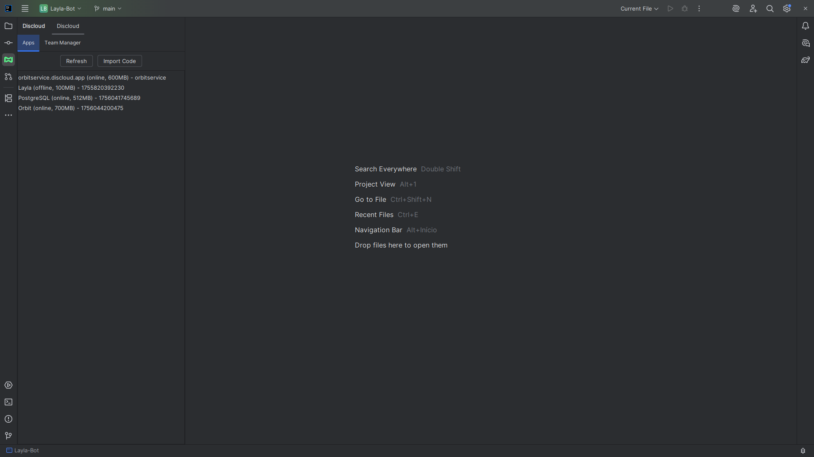
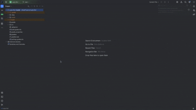
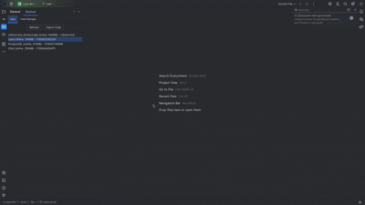

# Discloud Plugin for Jetbrains

[](https://plugins.jetbrains.com/)  
[](https://discloud.com/)

Um plugin simples para **IntelliJ IDEA** que facilita enviar seus projetos para a **Discloud** diretamente do IDE. Suporta deploy via `.jar` e upload completo de projetos (cria projeto na Discloud via `/upload`), além de oferecer uma Tool Window para gerenciar aplicações.

---

## ✨ Destaques

- Envio rápido de artefatos via clique-direito (**Commit Discloud**)  
- Upload completo do projeto (chama `POST /upload`) quando houver `discloud.config` no root do projeto  
- Tool Window para listar e gerenciar apps (start / restart / stop / backup / logs)  
- Suporte multi-linguagem para commits e empacotamento:
  - **Java** (.jar)
  - **Go**
  - **Rust**
  - **Python**
  - **PHP**
  - **Ruby**
- Detecção automática de runtime por arquivos de configuração (ex.: `go.mod`, `Cargo.toml`, `requirements.txt`, `composer.json`, `Gemfile`, `pom.xml`, `build.gradle`) ou por extensão de arquivo  
- Para Go e Rust, tenta executar `go build` / `cargo build --release` e faz upload do binário gerado quando possível  
- Fallback: se não for possível compilar, gera um ZIP do projeto e envia  
- Exclusões inteligentes ao zipar (`.git`, `node_modules`, `venv`, `__pycache__`, `target`, `build`, `.idea`, `.gradle`)  
- API Key configurável e persistida nas Settings do IntelliJ (solicita ao usuário se não estiver configurada)

---

## 📦 Funcionalidades

### Commit Discloud
- Envia `.jar` ou artefato gerado para um app existente via endpoint `PUT /app/{id}/commit`.
- Detecta linguagem, tenta buildar (quando aplicável) e cria o artefato apropriado (JAR, binário zipado ou ZIP do projeto).
- Envia também um campo `runtime` quando aplicável para ajudar a Discloud a identificar o tipo de aplicação.

### Upload (criar projeto)
- Se existir `discloud.config` na raiz do projeto, o plugin permite empacotar todo o projeto em um ZIP e chamar `POST /upload` para criar o projeto na Discloud.
- Não executa upload se `discloud.config` não existir.

### Tool Window
- Lista aplicações vinculadas à sua conta Discloud (nome, status online/offline, RAM).
- Botões: Start, Restart, Stop, Backup, Logs.
- Download de backup direto para a pasta do projeto.
- Visualização de logs em uma janela dentro do IDE.

### UX e Segurança
- Operações longas rodam em background (ProgressManager / Tasks).
- Mensagens e erros são mostrados via JOptionPane / Messages.
- Validações de seleção e presença de token para evitar erros.
- Executar builds localmente significa rodar código — use apenas com projetos confiáveis.

---

## 🔧 Requisitos

- IntelliJ IDEA (Community ou Ultimate)  
- Para builds automáticos de Go e Rust é necessário ter `go` e `cargo` instalados no sistema  
- Verifique limites e permissões da sua conta Discloud antes de usar `/upload`

---

## 📥 Instalação (modo dev / sandbox)

1. Clone o repositório:
   ```bash
   git clone https://github.com/0xviny/discloud-plugin.git
   cd discloud-plugin

2. Abra no IntelliJ IDEA.
3. Execute o plugin em sandbox:

    * `Gradle Tool Window → Tasks → intellij → runIde`

---

## 🔑 Configuração da API Key

Na primeira execução, o plugin pedirá sua **API Key da Discloud**. Também é possível alterar em:

`File → Settings → Tools → Discloud Settings`

A chave é salva nas configurações do IntelliJ e reutilizada em operações futuras.

---

## 🚀 Como usar

### Commit de um `.jar`

1. Gere o `.jar` do seu projeto.
2. No Project Explorer, clique com o botão direito no `.jar`.
3. Selecione **Commit Discloud**.
4. Escolha o app destino (quando solicitado) e aguarde o upload.

### Upload completo (cria projeto)

1. Adicione `discloud.config` na raiz do projeto.
2. Execute a ação **Upar na Discloud** (ou equivalente no plugin).
3. O plugin empacota o projeto em ZIP e chama `POST /upload`.
4. Aguarde o retorno e confira o ID / mensagem da API.

---

## 🖼️ Screenshots

### Tool Window


### Actions row (Upload, Commit)


### Logs modal


### Import Code

---

## 📝 Changelog

### 1.0.0 — Initial

* Tool Window para gerenciar aplicações
* Commit de `.jar` e suporte a múltiplas linguagens (Java, Go, Rust, Python, PHP, Ruby)
* Upload completo via `/upload` quando `discloud.config` estiver presente
* Build automático para Go e Rust quando possível, com fallback para ZIP
* Exclusões ao empacotar e UX com feedback no IDE

---

## 📌 Roadmap

* Suporte a deploy automático pós-build
* Upload incremental (enviar apenas arquivos mudados)
* Mostrar notificações no IDE em vez de modais
* Suporte a variáveis de ambiente e mapeamento de portas no `discloud.config`
* Publicação no JetBrains Marketplace

---

## 🤝 Contribuindo

Contribuições são bem-vindas. Abra uma Issue para discutir mudanças ou envie um Pull Request com a sua melhoria.

---

## ⚖️ Licença

Distribuído sob a licença **MIT**. Veja o arquivo `LICENSE` para detalhes.

---

## 💙 Créditos

* Discloud — hospedagem utilizada e APIs
* IntelliJ Platform SDK — base para desenvolvimento de plugins